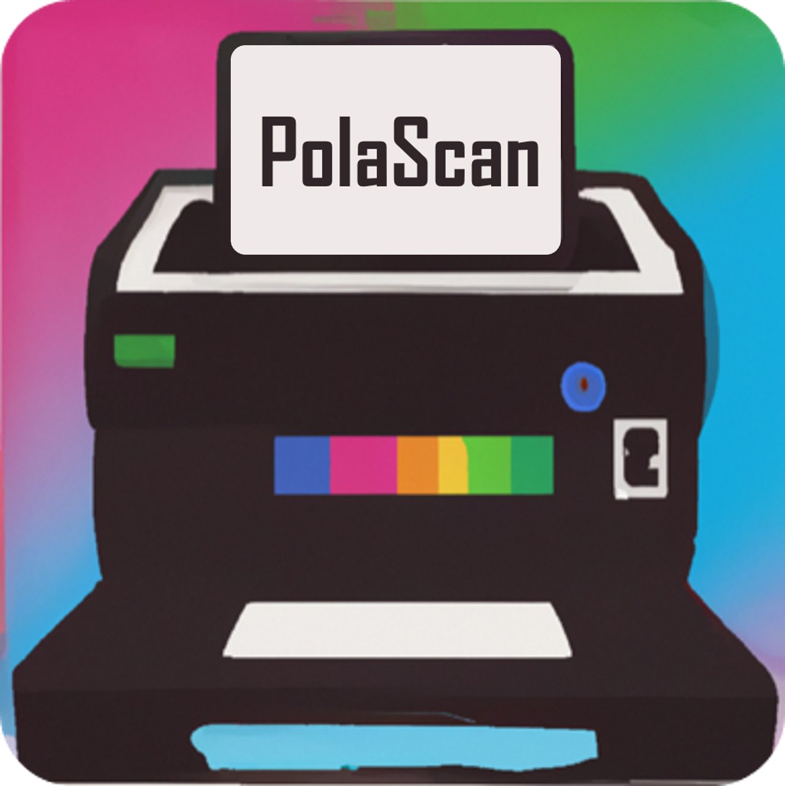

# PolaScan

Automatically scan, crop and organize your Polaroid pictures by date and geolocation data with PolaScan. 

## Features

### AI Image cropping
Using Azure Custom Vision with a model custom trained to recognize polaroid images, PolaScan is able to detect and accurately crop and straighten Polaroid Photos from an image or a scan.

### Date Recognition
PolaScan will detect a handwritten date on the front of a Polaroid, and add it to the metadata of the scanned image.

### Google Timeline data
 Download your google timeline data from [takeout.google.com](https://takeout.google.com) and add it to PolaScan to match the dates on your polaroids to get the coordinates from when time photo was taken.
 
